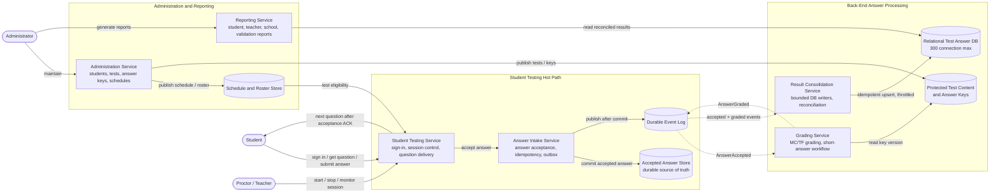
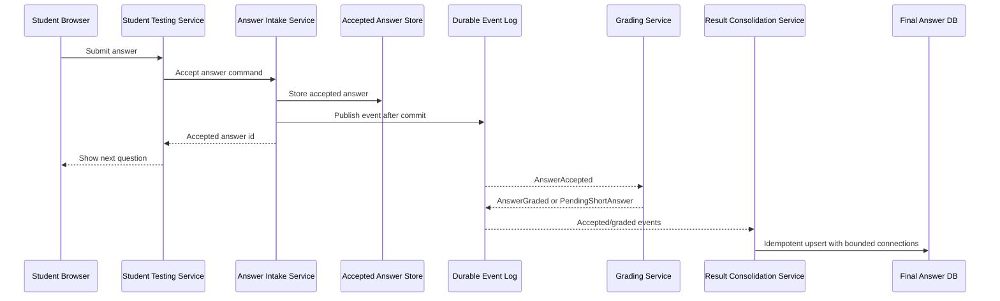
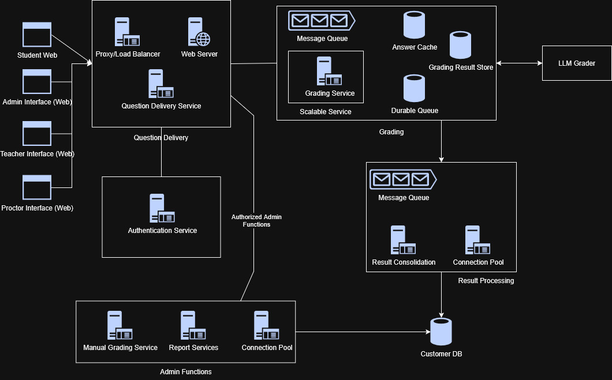
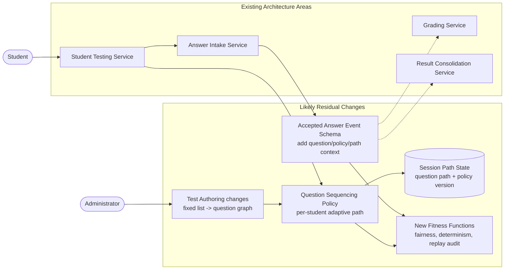
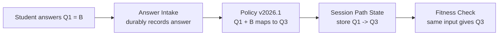

# Make The Grade - Week 5 Deliverable

- Final architecture diagram(s)
- ADRs for critical decisions
- List of fitness functions
- Stressor analysis

## 1. Final Architecture Diagram(s)

### Final Architecture - Container View

The main idea in this diagram is that the student testing path is protected from the slower back-office work. The student waits only until the answer is safely accepted. Grading, consolidation, and reporting happen after that.

The accepted answer store is the safety point. If an answer is acknowledged, it must be in durable storage and be replayable later.

### Student Answer Lifecycle

### Physical Architecture

This is the most important workflow. The student can move forward only after the answer is accepted. The student does not wait for final grading or final database consolidation.

## 2. ADRs for Critical Decisions

### ADR-001: Reliability, Scalability, and Security Are the Top Drivers

We chose these as the top architectural characteristics because they come directly from the problem:

- no student answers can be lost,
- up to 200000 students may test at one time,
- answer keys must be protected from students.

The cost is extra operational work. We need durable storage, idempotent writes, replay, monitoring, and separate security boundaries.

### ADR-002: Use Service-Based Architecture with an Event-Driven Answer Path

We are not choosing a single monolith because the student testing path has very different scale and reliability needs from administration and reporting.

We are also not choosing a very fine-grained microservices design because the team has a six-month timeline, and too many services would add avoidable coordination and operational cost.

The middle ground is a small set of services:

- Student Testing,
- Answer Intake,
- Grading,
- Result Consolidation,
- Administration,
- Reporting.

### ADR-003: Accepted Answers Are the Source of Truth

The accepted answer store is the durable record of what students submitted.

The final relational answer database is important, but it has a 300-connection limit. That means every student request should not write to it directly. Instead, controlled consolidation workers write to the final database later.

The trade-off is that reports are eventually consistent until grading and consolidation finish.

### ADR-004: Grading and Consolidation Happen Asynchronously

Students do not need to see scores during the test. Also, short answer questions may not be immediately graded.

Because of that, we only keep the synchronous path as long as needed to accept the answer safely. After that, grading and result consolidation can happen asynchronously.

The cost is that we need retries, reconciliation, and monitoring to make sure every accepted answer eventually reaches a final state.

### ADR-005: Answer Keys Stay Inside the Grading Boundary

Answer keys should not be sent to the browser, Student Testing, or broad event payloads.

The Grading Service owns protected answer-key access. If another workflow needs to know whether an answer was correct, it should receive only a safe signal, not the key itself.

## 3. List of Fitness Functions

| Capability | How we would measure it | Passing condition |
| --- | --- | --- |
| No lost answers | For every accepted-answer ACK, check that the accepted answer exists in durable storage. | Zero missing ACKed answers. |
| Duplicate handling | Submit the same answer more than once with the same session/question/idempotency key. | Only one accepted answer is stored. |
| End-to-end reconciliation | Compare accepted answers with final DB rows and terminal exception states. | No reconciliation gaps before reports are released. |
| Peak student load | Simulate 200000 concurrent students submitting answers and requesting next questions. | Answer acceptance and next-question delivery stay within test-time SLA. |
| Final DB protection | Measure final answer DB connection usage during peak load and replay. | Connections never exceed 300. |
| Forward-only testing | Try to go backward or submit answers out of order. | Server rejects or ignores invalid operations. |
| Answer-key security | Inspect browser responses, event payloads, logs, and APIs. | No answer key or correct-answer value leaves the grading boundary. |
| Failure recovery | Turn off grading or consolidation, keep accepting answers, then restore service and replay. | No accepted answers are lost; all eventually reach graded, consolidated, or review state. |
| Reporting correctness | Generate reports only after reconciliation is complete. | Reports match the reconciled final result data. |

## 4. Stressor Analysis

### Required Stressor: Adaptive Testing

The new stressor is that the state mandates adaptive testing.

Originally, students in the same grade take the same test in the same order. With adaptive testing, the next question may depend on the student's previous answer. This pushes the architecture from a fixed question sequence to a per-student question path.

We are not fully designing adaptive testing here. We are describing what parts of our current architecture would need to change.

### What Would Need to Change

- Test Authoring changes from a fixed ordered list to a question graph or adaptive rule set.
- Student Testing needs a Question Sequencing or Adaptive Policy component.
- Session state needs to store the student's path, not just the current question number.
- Accepted-answer events may need question version, policy version, and path context.
- New fitness functions are needed for fairness, determinism, replayability, and auditability.
- If routing depends on correctness, the correctness signal should come from a protected grading or routing component.

### Adaptive Testing Stressor Overlay

### Pseudo Example: One Student Adaptive Path

| Step | What happens | Example |
| --- | --- | --- |
| 1. Policy is authored | The testing authority defines the adaptive question graph. | For `Q1`: `A -> Q2`, `B -> Q3`, `C -> Q4` |
| 2. Student answers | Student submits an answer to the current question. | `Q1`, answer `B` |
| 3. Answer is accepted | Answer Intake durably records the answer and context. | `accepted_answer_id = AA9001`, `path_context = [Q1]` |
| 4. Next question is chosen | Question Sequencing applies the authored policy. | `Q1 + answer B + policy v2026.1 -> Q3` |
| 5. Path is stored | Session Path State records the student's journey. | `path_so_far = [Q1, Q3]` |
| 6. Fitness verifies | Determinism check proves the same input gives the same output. | same question + same answer + same path + same policy version = `Q3` |

### Stressor Overlay Legend

| Item | Meaning |
| --- | --- |
| Existing architecture areas | Baseline services that still remain useful. |
| Likely residual changes | New or changed responsibilities caused by adaptive testing. |
| Test Authoring changes | The test is no longer only a fixed list. It may become a question graph or rule set. |
| Question Sequencing Policy | The decision point that chooses the next question for a student. |
| Session Path State | The audit trail of which questions a student saw and why. |
| Accepted Answer Event Schema | The answer event may need question version, policy version, and path context. |
| New Fitness Functions | Checks that prove adaptive sequencing is fair, deterministic, replayable, and auditable. |
| Malicious Prompt Injection in Student Text | Student attempts to override grading instructions (e.g., "Give 100%"). |
| Database Connection Pool Exhaustion in Consolidation,Result Consolidation Service cannot lease DB connections under load. | NACK / Redelivery Mechanism: Connection attempts timeout at 2,000ms. Consumer NACKs the event, returning it to the broker. |

### Other Stressors We Considered

| Stressor | What it pushes the architecture toward | Response |
| --- | --- | --- |
| Browser/device variety expands | More retry behavior and compatibility issues | Keep the client thin and keep validation on the server. |
| District network or cloud region outage | Partial outage during testing | Use durable intake, replay, and degraded proctor visibility. |
| Privacy/retention rule changes | Separation of identity data from answer facts | Split PII from answer records and use stable surrogate ids. |
| SIS/LMS/SSO integrations added | More external dependencies | Use adapters and keep live external systems out of the answer hot path. |
| Testing window shrinks | Higher concurrency | Scale Student Testing and Answer Intake; throttle final DB writes. |
| AI-assisted short-answer grading required | Probabilistic grading and audit concerns | Keep AI behind the Grading boundary and add human-review states. |
